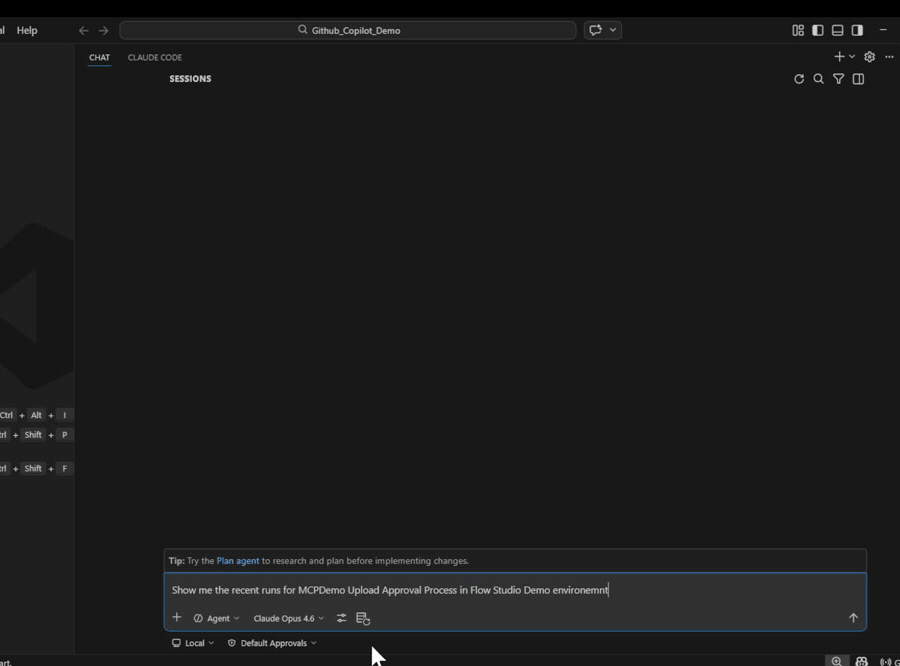
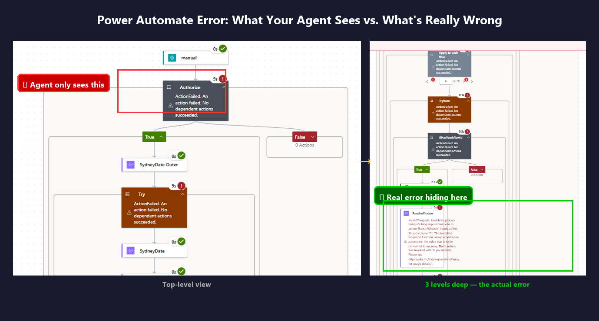
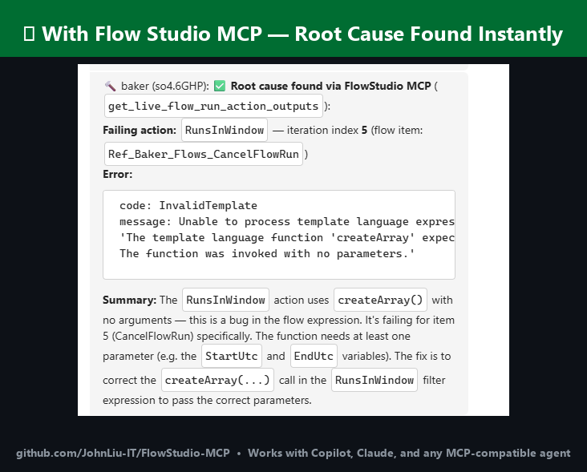

# FlowStudio MCP — Power Automate Skills for AI Agents

Inspect Power Automate flow runs beyond what the portal shows.
Retrieve action inputs, outputs, loop iterations, and nested failures
using AI agents like Copilot, Claude, and Codex.



**The portal shows the top-level error. The agent finds the root cause.**





## When you need this

- Your agent cannot explain why a flow run failed
- The portal does not show nested action errors or child flow failures
- You need to compare two runs of the same flow to find what changed
- Loop iteration outputs are hidden behind "click to expand" in the portal
- JSON inspection in the run history is not enough
- Expression evaluation errors give you a status code but no context

## Portal vs API vs MCP

| Capability | Portal | Power Automate API | FlowStudio MCP |
|---|---|---|---|
| View run status | Yes | Yes | Yes |
| Action-level inputs/outputs | Partial (click-through) | Limited | Full |
| Nested child flow errors | No | No | Yes — traces parent to child |
| Loop iteration details | Collapsed | Not available | Full per-iteration outputs |
| Expression error context | Status code only | Status code only | Input values + failed expression |
| Resubmit failed runs | Manual | API call | Agent-initiated |
| Modify flow definition | Designer only | Full JSON PATCH | Agent builds + deploys |

## Skills

| Skill | Description |
|---|---|
| [`power-automate-mcp`](skills/power-automate-mcp/) | Connect to and operate Power Automate cloud flows — list flows, read definitions, check runs, resubmit, cancel |
| [`power-automate-debug`](skills/power-automate-debug/) | Step-by-step diagnostic process for investigating failing flows |
| [`power-automate-build`](skills/power-automate-build/) | Build, scaffold, and deploy Power Automate flow definitions from scratch |

Each skill follows the [Agent Skills specification](https://agentskills.io/specification)
and works with any compatible agent.

### Supported agents

Copilot, Claude Code, Codex, OpenClaw, Gemini CLI, Cursor, Goose, Amp, OpenHands

## Quick Start

### Install via skills.sh

Search for [flowstudio on skills.sh](https://skills.sh/?q=flowstudio), or:

```bash
npx skills add github/awesome-copilot -s flowstudio-power-automate-mcp
npx skills add github/awesome-copilot -s flowstudio-power-automate-debug
npx skills add github/awesome-copilot -s flowstudio-power-automate-build
```

### Install via ClawHub

```bash
npx clawhub@latest install power-automate-mcp
```

### Install via Smithery

```bash
npx smithery skill add flowstudio/power-automate-mcp
```

### Manual install

Copy the skill folder(s) into your project's `.github/skills/` directory
(or wherever your agent discovers skills).

### Connect the MCP server

**Claude Code:**
```bash
claude mcp add --transport http flowstudio https://mcp.flowstudio.app/mcp \
  --header "x-api-key: <YOUR_TOKEN>"
```

**Codex** (`~/.codex/config.toml`):
```toml
[mcp_servers.flowstudio]
url = "https://mcp.flowstudio.app/mcp"

[mcp_servers.flowstudio.http_headers]
x-api-key = "<YOUR_TOKEN>"
```

**Copilot / VS Code** (`.vscode/mcp.json`):
```json
{
  "servers": {
    "flowstudio": {
      "type": "http",
      "url": "https://mcp.flowstudio.app/mcp",
      "headers": { "x-api-key": "<YOUR_TOKEN>" }
    }
  }
}
```

Get your token at [mcp.flowstudio.app](https://mcp.flowstudio.app).

## Real debugging examples

These are from real production investigations, not demos.

- **[Expression error in child flow](examples/fix-expression-error.md)** —
  `contains(string(...))` crashed on a nested property. Agent traced through
  parent flow, into child, through loop iterations, and found the failing input.
  Portal showed "ExpressionEvaluationFailed" with no context.

- **[Data entry, not a flow bug](examples/data-not-flow.md)** —
  User reported two "bugs" back to back. Agent proved both were data entry
  errors (missing comma in email, single address in CC field). Flow was correct.
  Diagnosed in seconds.

- **[Null value crashes child flow](examples/null-child-flow.md)** —
  `split(Name, ', ')` crashed when 38% of records had null Names. Agent traced
  parent to child to loop to action, found the root cause, and deployed a fix
  via `update_live_flow`.

## Prerequisites

- A [FlowStudio](https://mcp.flowstudio.app) MCP subscription
- MCP endpoint: `https://mcp.flowstudio.app/mcp`
- API key / JWT token (passed as `x-api-key` header)

## Repository structure

```
skills/
  power-automate-mcp/       core connection & operation skill
  power-automate-debug/     debug workflow skill
  power-automate-build/     build & deploy skill
examples/                   real debugging walkthroughs
README.md
LICENSE                     MIT
```

## Available on GitHub

Works with Copilot, Claude, and any MCP-compatible agent.

- [awesome-copilot](https://github.com/github/awesome-copilot) (merged)
- [skills.sh](https://skills.sh/?q=flowstudio) (3K+ installs)
- [Smithery](https://smithery.ai/skills/flowstudio/power-automate-mcp) (published)
- [ClawHub](https://clawhub.ai) (v1.1.0)
- [anthropics/skills](https://github.com/anthropics/skills/pull/555) (PR #555)
- [openai/skills](https://github.com/openai/skills/pull/231) (PR #231)

## Contributing

Contributions welcome. Each skill folder must contain a `SKILL.md` with the
required frontmatter. See the existing skills for the format.

## License

[MIT](LICENSE)

---

Keywords: Power Automate debugging, flow run history, expression evaluation failed,
child flow failure, nested action errors, loop iteration output, agent automation MCP,
Power Platform AI, flow definition deploy, resubmit failed run
